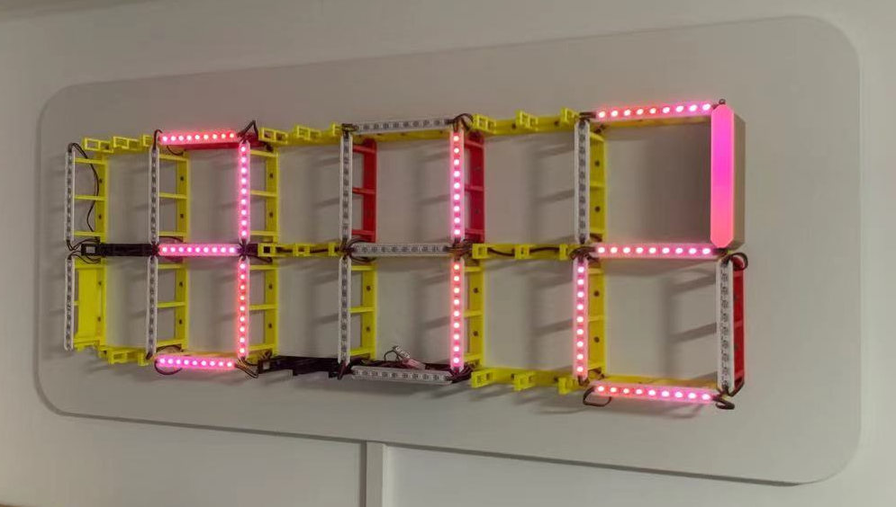

### 引用内容
1. [3D文件，接线顺序 (YT DIY Machines)](https://www.youtube.com/watch?v=8E0SeycTzHw)
2. [修改过的WLED固件 (GitHub NeariX67)](https://github.com/NeariX67/WLED_Clock)
3. [编译固件 (GitHub Aircookie, WLED原作者)](https://github.com/Aircoookie/WLED/wiki/Compiling-WLED)

### 需要硬件
1. 背板，最小尺寸112x39x3
2. 3D打印件：
   1. 支撑架 32个：随意颜色，消耗掉不爱用的材料
      * 其中1-2个 [带底部开口走线](core-hole.stl)
      * 其余 [正常](core-normal.stl)
   2. [灯带粘贴条](LEDMount.stl) 打印白色 32个
   3. 外壳：顶部需要透光白色，然后切换木色
      * [双口 无射灯开口](Sleeve1.STL) 16个
      * [四口](Sleeve3.STL) 16个
3. LED灯条： WS2812 60珠/m
   * 数字每节9珠，23节：(3x7+2)x9=207珠
   * 信号增强牺牲1珠
   * 可选：射灯12珠
4. Sonoff Basic R2
5. 5V10A电源
6. 1000uF电容
7. 电源线
8. 20AWG 3股 LED线
   * 22cm 20根
   * 37cm 2根
   * 50cm 1根