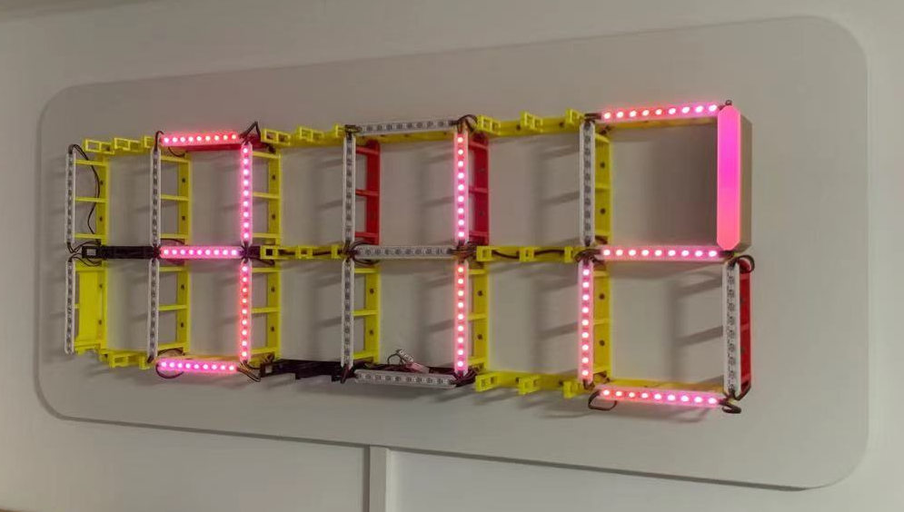

### 引用内容
1. [3D文件，接线顺序 (YT DIY Machines)](https://www.youtube.com/watch?v=8E0SeycTzHw)
2. [修改过的WLED固件 (GitHub NeariX67)](https://github.com/NeariX67/WLED_Clock)
3. [编译固件 (GitHub Aircookie, WLED原作者)](https://github.com/Aircoookie/WLED/wiki/Compiling-WLED)

### 需要硬件
1. 背板，最小尺寸112x39x3
2. 3D打印件：
   1. 支撑架 32个
      * 其中1-2个 [带底部开口走线](./wled-clock/core-hole.stl)
      * 其余 [正常](./wled-clock/core-normal.stl)
   2. [灯带粘贴条](./wled-clock/LEDMount.stl) 32个
   3. 外壳